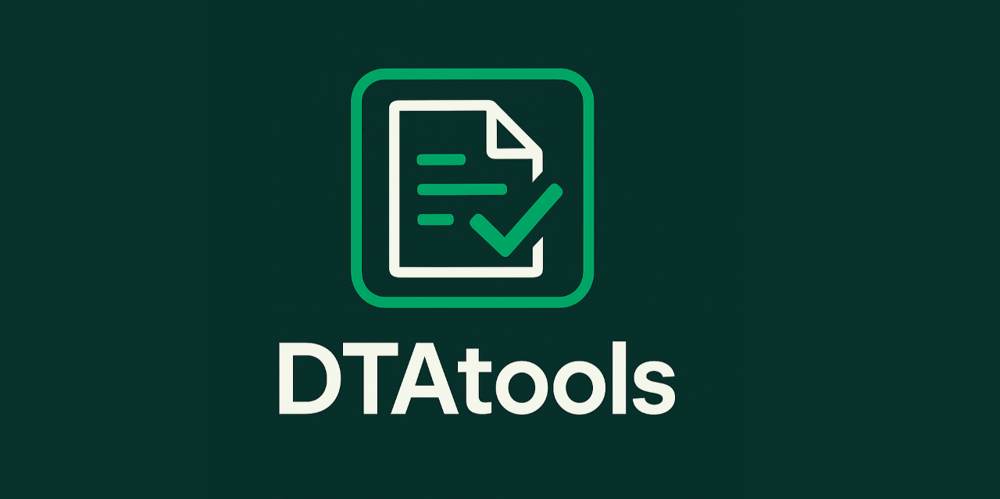

# DTAtools R-Package



Data Transfer Agreements (DTAs) or data transmission statements (DTS) play a pivotal role in the secure and compliant exchange of data between stakeholders such as research organizations or vendors with pharma companies, particularly in clinical or regulatory environments where data integrity and specification adherence are critical. However, the manual process of validating these data transfers is both error-prone and time-consuming, leading to repeated submissions and significant time loss.

Introducing `DTAtools`, a comprehensive solution designed to streamline the management of DTAs / DTS. `DTAtools` stores DTA definitions in the user-friendly YAML format, offering flexibility and compatibility across various DTA scenarios.

`DTAtools` is equipped with a suite of features to enhance user experience and ensure data integrity. It conducts validity checks to confirm adherence to required standards, formats and schemas, and provides convenience functions to eliminate repetitive coding and minimize errors. The package's error checks ensure consistent and error-free data processing. Additionally, DTAtools can read and generate human-readable DTA formats, expediting the drafting process of these documents.

`DTAtools` is open-sourced by Boehringer-Ingelheim to provide an easy tool for external and internal collaborators to validate data before file transfer, following DevOps principles of detecting error fast and automatically.

## Features

-   Import/export DTA specifications from/to YAML and Word documents
-   Comprehensive validation of data for: type, format, nullability, allowed values, and regex patterns
-   Validation of schema rules (column based logic)

## Installation

For now, it is just possible to install the development version from GitHub:

``` r
remotes::install_github("Boehringer-Ingelheim/DTAtoolsR")
```

## Quickstart


Load required libraries

```{r setup}
require(DTAtools)
```

Validate data stored in `data.tsv` with specifications stored in `spec.yaml`

```{r}
# Load specs
specs <- importDTAColumnSpecCollectionFromYaml("specs.yaml")

# Load data
data <- fread("data.tsv")

# Validate
dt <- DTAContainer(specs, list(my_data = data))

# print error table if there is an error, else
if( .... ) {
  
} else {
  message("data.tsv is successfully validated")
}
```

## Usage

### Import DTA specifications

DTA / DTS specifications are stored in the human and machine readable YAML format. Generally, they are store in either dedicated YAML files for are part of YAML configuration files.

Specification contain definitions of:

-   **columns:** defines column names, format specification and optionally patterns or selection for values in the column. More details in section [YAML Column Format](#yaml-column-format).
-   **rules:** defines rules for columns, e.g. if column A is empty, then columns B must contain a value. More details in section [YAML Schema Rule Specification](#yaml-schema-rule-specification).
-   **metadata:** DTA meta data about version, author etc. More details in section [YAML Metadata].

First, you import the specifications from a YAML file.

```{r}
specs <- importDTAColumnSpecCollectionFromYaml("spec.yaml")
```

> Note: Use the `tag` argument of `importDTAColumnSpecCollectionFromYaml` if `columns`, `rules` and `metadata` are nested in the YAML file, e.g. if they are under `DTA: format:`, then add `tag=c("DTA", "format")`.

### Load and validate data

The next step is to import the data and create a `DTAContainer` object. Once created, the `DTAContainer` object will validate the data for the specifications right away.

``` r
table <- data.frame(STUDYID = c("1234", "1234"), VISIT = c("V01", "V02"))
data_obj <- DTAContainer(specs, list(my_table = table))
```

TODO: DESCRIBE what happens next

## Additional features

### Export Spec Table to Word

If you want to export the specifications stored in the YAML as a table to Word file you can use this function:

``` r
exportDTASpecTable(specs, "dta_spec_table.docx")
```

### Export Column Values Table

TODO: insert what it is exactly doing

``` r
exportColumnValueTable(specs, "column_value_table.docx", id = "VISIT")
```

## YAML Column Format {#yaml-column-format}

Columns specifications can contain

-   *id:* (mandatory) the ID of the column
-   *label:* (mandatory) the label of columns
-   *description:* (optional) the description of the column
-   *type:* (mandatory) the SAS type like Num, Char, Date9
-   *format:* (mandatory) the SAS format like 10., \$10
-   *nullable:* (mandatory) if a columns has to contain values (Yes, No or True, False)
-   *pattern:* (optional): Regex for value check
-   *values:* (optional): A list of possible values

Here is an example of a column `SUBJIDN` with a pattern

``` yaml
columns:
  - id: SUBJIDN
    label: Subject identifier for the study
    type: Num
    format: 10.
    nullable: No
    pattern: "^[0-9]{10}$"
```

Here is an example of a column `GFGRPID` with

``` yaml
columns:
  - id: SEX
    label: Sex
    type: Char
    format: $6
    nullable: Yes
    description: "Self reported sex, empty if not reported"
    values:
      - "male"
      - "female"
      - "other"
```

## YAML Schema Rule Specification {#yaml-schema-rule-specification}

The `DTAtools` package supports schema-based validation of tabular data using declarative rules defined in YAML. These rules are evaluated after column-level validation and allow for complex inter-column logic enforcement.

### Structure

Rules must be defined under the top-level key `rules` in the YAML file. Each rule is a list item with a required `id`, `type`, and additional fields depending on the rule type.

### Supported Rule Types

#### 1. `check_equal`

Ensures that if a condition is met in one column, another column must equal a specific value.

``` yaml
- id: rule_equal_example
  type: check_equal
  condition:
    column: VISIT
    equals: "V03"
  then:
    column: STATUS
    equals: "COMPLETED"
```

#### 2. `check_equal`

Ensures that if a condition is met in one column, another column must not equal a specific value.

``` yaml
- id: rule_unequal_example
  type: check_unequal
  condition:
    column: VISIT
    equals: "V03"
  then:
    column: STATUS
    equals: "DROPPED"
```

#### 3. `check_range`

Ensures that values in a numeric column fall within a specified range.

``` yaml
- id: rule_range_example
  type: check_range
  column: AGE
  range: [18, 65]
```

#### 4. `check_dependency`

Ensures that if a condition is met, another column must not be null, empty, or NaN.

``` yaml
- id: rule_dependency_example
  type: check_dependency
  condition:
    column: CONSENT
    equals: "YES"
  then:
    column: CONSENT_DATE
```

#### 5. `check_mutual_exclusive`

Ensures that two columns are not both populated in the same row.

``` yaml
- id: rule_mutual_exclusive_example
  type: check_mutual_exclusive
  columns: [AE_TERM, SAE_TERM]
```

#### 6. `check_unique`

Ensures that all values in a column are unique.

``` yaml
- id: rule_unique_example
  type: check_unique
  column: SUBJECT_ID
```

#### 7. `check_allowed_combinations`

Ensures that only specific combinations of values across multiple columns are allowed.

``` yaml
- id: rule_allowed_combinations_example
  type: check_allowed_combinations
  columns: [VISIT, STATUS]
  allowed:
    - ["V01", "COMPLETED"]
    - ["V02", "DROPPED"]
```

## YAML Metadata

Metadata can contain

-   **version:** Version of specifications
-   **author:** Author
-   **create:** Date of creation
-   **description:** Description of specifications

Example:

---
metadata:
  - version: "1.0.0"
    author: "Thomas Schwarzl"
    created: "2025-07-08"
    description: "GF Domain Specification"
---

## Technical

`DTAtools` is build on the S7 object system and uses json schema for validation.

-   Define column specifications with `DTAColumnSpec`
-   Group specifications into collections with `DTAColumnSpecCollection`
-   Validate data frames against specifications using `DTAContainer`
-   Export documentation tables to Word using `flextable`

### Core Classes

-   `DTAColumnSpec`: Defines a single column's metadata and constraints
-   `DTAColumnSpecCollection`: A named list of DTAColumnSpec objects
-   `DTAContainer`: A validated specs of data frames against a spec specs

### Validation Functions

-   `validateTable()`: Validates a data frame against a spec specs
-   `validateColumn()`: Validates a single column
-   `checkType(), checkFormat(), checkNullable(), checkValues(), checkPattern()`: Low-level validators

### Export Functions

-   `writeTableToFile()`: Write validated tables to disk with optional compression and metadata
-   `exportDTASpecTable()`: Export full spec documentation to Word
-   `exportColumnValueTable()`: Export allowed values of a column to Word

#### Rules Engine

-   Rule types implemented:
    -   `check_equal`
    -   `check_unequal`
    -   `check_range`
    -   `check_dependency`
    -   `check_mutual_exclusive`
    -   `check_unique`
    -   `check_allowed_combinations`

### Manually add specs

Here an example how to manually define column specs

``` r
col1 <- DTAColumnSpec(id = "STUDYID", type = "Char", nullable = FALSE)
col2 <- DTAColumnSpec(id = "VISIT", type = "Char", nullable = TRUE)
specs <- DTAColumnSpecCollection(columns = list(STUDYID = col1, VISIT = col2))
```

## Important Notes

-   All rules must include a unique id.
-   Rule types must match exactly one of the supported types.
-   Missing or malformed rules will trigger validation errors before data evaluation.
-   when importing yaml from DSO, patterns must be non-quoted strings

## Credits

`DTAtools` was developed by

-   Daniel Schreyer
-   Thomas Schwarzl
