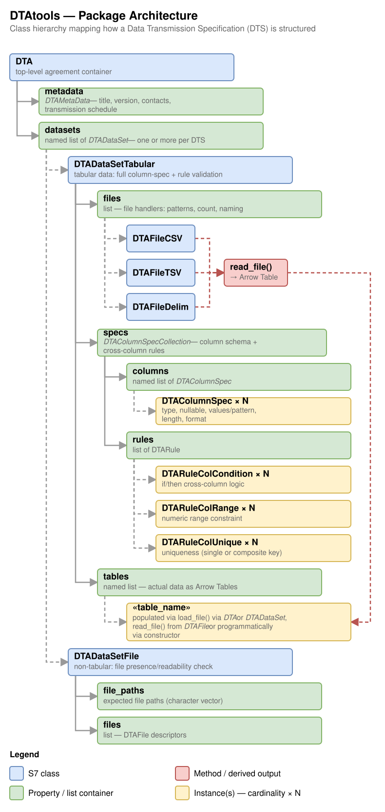

# DTAtools R-Package

<!-- badges: start -->

[](https://github.com/Boehringer-Ingelheim/DTAtoolsR/actions/workflows/R-CMD-check.yaml)

<!-- badges: end -->


**Data Transmission Agreements (DTAs)** and **Data Transmission Specifications
(DTS)** play a pivotal role in the secure and compliant exchange of data
between stakeholders — such as research organizations or vendors working with
pharma companies — particularly in clinical or regulatory environments where
data integrity and specification adherence are critical. However, manually
validating these data transmissions is error-prone and time-consuming, leading
to repeated submissions and significant time loss.

`DTAtools` streamlines the management of DTAs/DTS end to end. Specifications
are stored in human-readable **YAML**, offering flexibility and compatibility
across DTA/DTS scenarios. The package validates tabular data against those
specifications — types, nullability, allowed values, regex patterns, and
cross-column logic — and can also confirm that expected deliverable files were
received, are non-empty, and are readable.

`DTAtools` is open-sourced by Boehringer Ingelheim to give external and
internal collaborators an easy tool to validate data before transmission,
following the DevOps principle of detecting errors fast and automatically.

📖 **For a comprehensive walkthrough of every feature, see the
[full package vignette](vignettes/DTAtools.Rmd)** (`vignette("DTAtools")`
once installed).

## Features

- Import/export DTA/DTS specifications from/to YAML and Word documents
- Columns are read in the type the specification declares for them, so
  `"007"` in a text column stays `"007"`
- Comprehensive validation of tabular data: type, format, nullability,
  allowed values, and regex patterns
- Cross-column rule validation (`col_condition`, `col_range`,
  `col_unique`, `group_condition`)
- File-presence validation (`DTADataSetFile`) for non-tabular deliverables
- Detailed, queryable validation results (`results()`, `messages()`,
  `inspect()`)
- Export validated tables to disk with optional compression and MD5
  checksums
- Generate Word documentation tables directly from specifications, or the
  whole agreement as a document (`write_dta()`)
- Generate a standalone, self-contained HTML validation report
  (`write_validation_report()`) with a sortable, filterable, click-to-inspect
  message table
- An interactive Shiny application over the same objects (`run_dta_app()`)

## Installation

For now, it is only possible to install the development version from GitHub:

```r
remotes::install_github("Boehringer-Ingelheim/DTAtoolsR")
```

## Quickstart

```r
library(DTAtools)

# 1. Load a full DTA/DTS definition from YAML
#    (metadata + dataset specs + file handlers + rules — all in one file)
dta_file <- system.file("extdata", "clinical_dta.yaml", package = "DTAtools")
dta <- read_dta_from_yaml(dta_file)

# 2. Load the data file into the dataset defined in the YAML
csv_path <- system.file("extdata", "clinical_data.csv", package = "DTAtools")
dta <- load_file(dta, dataset = "clinical_data", file = csv_path)

# 3. Validate — check() runs import, column spec and rule validation for all datasets
dta <- check(dta)

# 4. Summarise results (one row per table)
results(dta)
```

Not every delivery needs a full DTA with metadata. When you only need to
validate *one* dataset, read the dataset definition directly with
`read_dataset_from_yaml()` — a standalone dataset YAML has the same shape as
one entry under a DTA's `datasets:` list (`name`, `type`, `files`, `columns`,
`rules`), just without the surrounding `metadata:` wrapper:

```r
# dataset.yaml has: name, type, files, columns, rules — no top-level metadata
ds <- read_dataset_from_yaml("dataset.yaml")

ds <- load_file(ds, file = csv_path, handler_index = 1)
ds <- check(ds)
results(ds)
```

## The Three Validation Axes

Validation reports on three independent axes. A failure on any one of them
fails the table, and `results()` counts each separately:

| Axis                     | Column            | What it means                                                      |
|--------------------------|-------------------|--------------------------------------------------------------------|
| **Schema** errors        | `n_columnspec_errors` | A value breaks a column constraint: type, `nullable`, `values`, `pattern`, `length` |
| **Rule** errors          | `n_rule_errors`   | A row breaks an inter-column rule: `col_condition`, `col_range`, `col_unique`, `group_condition` |
| **Import** errors        | `n_import_errors` | A value cannot be represented in the type its column declares      |

An **import error** is raised when a value is present in the source but does
not fit its declared type — the text `"unknown"` in a `SAS Num` column, for
example. The stored value becomes `NA`, the column keeps its declared type,
and the original text is retained and reported. **Any import error makes
validation fail**, on its own, even when every column spec constraint and every
rule passes.

```r
# AGE is declared numeric and permits missing values, so nothing here breaks
# the column spec and there are no rules at all — yet the table fails.
specs_imp <- DTAColumnSpecCollection(columns = list(
  SUBJECT_ID = DTAColumnSpec(id = "SUBJECT_ID", type = "SAS Char", nullable = FALSE),
  AGE        = DTAColumnSpec(id = "AGE",        type = "SAS Num",  nullable = TRUE)
))

ds_imp <- DTADataSetTabular(
  name   = "import_demo",
  specs  = specs_imp,
  tables = list(demo = data.frame(SUBJECT_ID = c("SUBJ0001", "SUBJ0002"),
                                  AGE        = c("34", "unknown")))
)
ds_imp <- check(ds_imp, quiet = TRUE)

validation_status(ds_imp)[, c("ok", "n_columnspec_errors",
                              "n_rule_errors", "n_import_errors")]
#>      ok n_columnspec_errors n_rule_errors n_import_errors
#> 1 FALSE               0             0               1

msgs <- messages(ds_imp)
msgs[msgs$source == "import", ]        # which values did not fit

# `import_raw` holds the original text; `import_reason` says why it did not fit
inspect(ds_imp, id = msgs$id[msgs$source == "import"][1])

as.data.frame(get_table(ds_imp, "demo"))   # the offending cell is now NA
```

> `check()` prints a per-axis console report for the column spec and rule passes
> but not for the import pass. When a table fails with no visible reason,
> read `n_import_errors` from `results()` or filter `messages()` on
> `source == "import"`.

See the [vignette's Import Errors
section](vignettes/DTAtools.Rmd) for the full treatment.

## Package Architecture

`DTAtools` organises objects into a layered hierarchy that maps directly to
how a Data Transmission Specification (DTS) is structured — a top-level `DTA`
holding metadata and one or more datasets, each either fully-validated
tabular data (`DTADataSetTabular`) or a simple file-presence check
(`DTADataSetFile`):

<p align="center">
  
</p>

<details>
<summary>Plain-text version (ASCII)</summary>

```
DTA                              ← top-level agreement container
├── metadata                     ← title, version, receiver/supplier
|   (DTAMetaData)                     contacts, transmission schedule, ..
│
└── datasets (named list of DTADataSet)  ← one or more datasets per DTS
    │
    ├── DTADataSetTabular        ← tabular data: for tables with
    |   |                            full column-spec + rule validation
    │   ├── files (list)         ← expected file handlers for various
    |   |   |                        input types, manage file names,
    │   │   ├── DTAFileCSV           which can have patterns,
    |   |   ├── DTAFileTSV           number of files, etc ..
    |   |   └── DTAFileDelim
    │   │       └── read_file()  → Arrow Table
    |   |
    │   ├── specs (DTAColumnSpecCollection)  ← column-level specs +
    |   |   |                                   cross-column rules
    │   │   |
    │   │   ├── columns (named list of DTAColumnSpec)
    |   |   |   └── DTAColumnSpec × N   ← one per column: type, nullable,
    │   │   │                            values/pattern, length, format
    |   |   └── rules (list of DTARule)
    │   │       ├── DTARuleColCondition × N  ← if/then cross-column logic
    │   │       ├── DTARuleColRange × N      ← numeric range constraint
    │   │       └── DTARuleColUnique × N     ← uniqueness (single or
    |   |                                              composite key)
    |   |
    │   └── tables (named list)  ← actual data as Arrow Tables
    │       └── <table_name>     ← populated via load_file() or constructor
    │
    └── DTADataSetFile           ← non-tabular: file presence/readability check
        ├── file_paths           ← character vector of expected file paths
        └── files (list)         ← DTAFile descriptors (derived from file_paths)
```

</details>

**Validation flow**, regardless of which object type you use:

1. `load_file(dta, dataset, file)` — reads a file into the dataset using its
   file handler, typing each column as the specification declares it
2. `check(dta)` / `check(ds)` — runs the import, column spec and rule checks; always
   returns the updated object
3. `results(x)` — one-row-per-table summary (pass/fail, per-axis error counts)
4. `messages(x)` — one-row-per-error detail table (`source`, column, row, rule,
   message, `id`)
5. `inspect(x, id = N)` — deep-dive into a specific error message by its `id`

📖 See the [vignette's Package Architecture section](vignettes/DTAtools.Rmd) for the fully annotated diagram plus a node-by-node explanation.

## Usage

### Load specifications and datasets from YAML

Specifications are stored in the human- and machine-readable YAML format. A
specification contains definitions of:

- **columns:** column names, types, and optionally patterns or allowed
  values. See [YAML Column Format](#yaml-column-format).
- **rules:** cross-column logic, e.g. "if column A is empty, column B must
  contain a value". See
  [YAML Schema Rule Specification](#yaml-rule-specification).
- **metadata:** DTA/DTS metadata — title, version, contacts, transmission
  schedule. See [YAML Metadata](#yaml-metadata).

There are three ways to bring a specification into R, from most to least
common:

1. **A full DTA/DTS document** (`metadata:` + one or more `datasets:`) —
   `read_dta_from_yaml()`. The recommended entry point for production use;
   see the [Quickstart](#quickstart) above.
2. **A single, self-contained dataset definition** (`name`, `type`, `files`,
   `columns`, `rules` — no top-level `metadata:`) — `read_dataset_from_yaml()`.
   Ideal when you only need to validate one dataset, e.g. while iterating on
   a spec. Also shown in the [Quickstart](#quickstart) above.
3. **A bare list of column specs** (just `columns:` plus optional `rules:`,
   no `name`/`type`/`files`) — `import_specs_from_yaml()`. The most manual
   option: you build the `DTADataSetTabular` wrapper yourself.

```r
# Use case 3: bare specs only — you supply name/type/data yourself
specs <- import_specs_from_yaml("spec.yaml")
```

### Load and validate tabular data

Create a `DTADataSetTabular` object from column specs and one or more data
tables. `check()` validates every table on all three axes and returns the
updated object — always assign the result back.

```r
col1  <- DTAColumnSpec(id = "STUDYID", type = "SAS Char", nullable = FALSE)
col2  <- DTAColumnSpec(id = "VISIT",   type = "SAS Char", nullable = TRUE)
specs <- DTAColumnSpecCollection(columns = list(STUDYID = col1, VISIT = col2))

table <- data.frame(STUDYID = c("1234", "1234"), VISIT = c("V01", "V02"))
data_obj <- DTADataSetTabular(name = "my_dataset", specs = specs,
                              tables = list(my_table = table))
data_obj <- check(data_obj)

results(data_obj)   # one row per table: status + per-axis error counts
messages(data_obj)  # one row per error: source, column, row, rule, message, id
```

`check()` also takes `force` (revalidate even when nothing changed),
`persist` and `artifact_dir` (where per-table validation artifacts are
written), `quiet`, and `tables` (restrict to named or indexed tables;
`datasets` on a `DTA`).

### Compressed input

A gzipped data file is read exactly like an uncompressed one. Arrow
decompresses `.gz` on the fly, and a specification that declares `data.csv` is
satisfied by `data.csv.gz` — compression is a transport detail, so the YAML
never has to mention it:

```r
# The handler declared in the YAML is `clinical_data.csv`.
dta <- read_dta_from_yaml(system.file("extdata", "clinical_dta.yaml", package = "DTAtools"))
dta <- load_file(dta, 1, file = "clinical_data.csv.gz")   # accepted
dta <- check(dta, quiet = TRUE)
```

The results are identical to validating the uncompressed file, including row
numbers, and `validate_file_stream()` still reads a compressed file in batches
rather than expanding it into memory. An anchored filename pattern such as
`^clinical_data\.csv$` matches the gzipped form too.

### Validating a file too large to load

The workflow above reads the file into memory first. For a file larger than
the memory available, that is not slow but impossible — so the file can be
scanned in batches instead, never holding more than one batch.

The ordinary way in is the `stream` argument on `load_file()`, which decides
how the table is *held* once loaded:

```r
# Read it into memory (an Arrow Table) — the usual case.
dta <- load_file(dta, 1, file = "transfer.csv", stream = "never")

# Keep it lazy (an Arrow Dataset); check() scans it in batches.
dta <- load_file(dta, 1, file = "transfer.csv", stream = "always")

# Default: "never" below 512 MB on disk, "always" above it.
dta <- load_file(dta, 1, file = "transfer.csv")

dta <- check(dta, quiet = TRUE)   # same verdict either way
```

Set the threshold, or the default itself, once per session:

```r
options(DTAtools.stream = "always")             # or "never" / "auto"
options(DTAtools.stream_threshold = 2 * 1024^3) # bytes; default 512 MB
```

Both paths find the same errors and reach the same verdict. They differ in
*when* import errors are found: reading into memory reports them during
`load_file()`, while streaming finds them during `check()` — so after a
streaming load the dataset's `@import_issues` is empty until `check()` has run.

#### Which one should you use?

| Situation | Use | Why |
|---|---|---|
| The file fits in memory comfortably | `"never"`, or just the default | About twice as fast, and import errors are reported immediately at load |
| The file is larger than memory, or close to it | `"always"` | The only option that works at all; memory stays flat regardless of row count |
| You will validate the same table many times | `"never"` | Every scan re-parses from disk; an in-memory table is parsed once |
| A large compressed file (`.csv.gz`) | `"always"`, explicitly | `"auto"` compares the size *on disk*, which is far smaller than the materialised size, so it under-triggers |
| You just want a verdict, with no `DTA` object | `validate_file_stream()` | Same scan and same result shape, without building the object model |
| You do not know, and sizes vary | `"auto"` (the default) | Small files stay fast; a file that would not fit switches by itself |

The short version: **stream when *holding* the file is the problem.** It buys
feasibility, not speed — scanning runs roughly twice as slow as validating a
table already in memory, because every batch pays its own overhead.

When tuning matters, `check()` takes the scan knobs:

```r
# Rows per batch (default getOption("DTAtools.stream_batch_rows", 131072L)),
# and a cap on how much per-cell failure detail is retained. Neither changes
# the counts or the verdict.
dta <- check(dta, batch_rows = 262144L, max_errors = 1000L)
```

`validate_file_stream()` does the same scan without a `DTA` object at all,
returning the details list directly:

```r
details <- validate_file_stream(specs, "transfer.csv")

details$ok                # TRUE / FALSE, the same three-axis verdict
details$n_columnspec_errors   # per-axis counts, as check() reports them
as.data.frame(details)    # one row per error: source, row, column, keyword, message
```

Nothing in the scan grows with the number of rows. Memory is bounded by the
batch size for the column checks, by the number of distinct keys for
uniqueness rules, by the number of distinct groups for grouped rules, and by
`max_errors` for how much per-cell detail is kept. Measured across a 16-fold
increase in input, the working set stayed flat at ~19 MB while the in-memory
path grew from 51 MB to 272 MB.

**This buys feasibility, not speed.** Scanning runs about twice as slow as
validating a table already in memory, because every batch pays its own
overhead. Use it when *holding* the file is the problem; otherwise `check()`
is the faster choice.

Two options are worth knowing:

```r
# Stop at the first problem instead of scanning to the end.
validate_file_stream(specs, "transfer.csv", fail_fast = TRUE)

# A missing column is decidable from the header. "stop" says so without
# reading the file; the default "scan" reports it once per row.
validate_file_stream(specs, "transfer.csv", on_missing_column = "stop")
```

A `fail_fast` result is explicitly incomplete: it carries a `partial_scan`
attribute and reports `NA` — not `TRUE` — for any axis it could not settle. A
rule that has not failed yet has not passed.

`cache_as_parquet()` rewrites a delimited file as Parquet so repeated
validations skip re-parsing text. Measure before using it: on a file whose
specs read every column it was **not** faster, because evaluating the
constraints dominates and parsing is not the bottleneck.

### Inspecting results in depth

`results()` and `messages()` cover most needs, but `messages()` gives you a
row per error with an `id` column. When you want the full story behind a
specific error — the exact cell value, the row in context, the JSON Schema
constraint that failed, the rows that violated a rule, or the original text
of a value that would not import — call `inspect(x, id = N)`.
`validation_status()` gives a compact status data frame when you just need
pass/fail counts.

The columns `inspect()` returns depend on which axis the error came from, so
select the `id` by `source` rather than by position:

```r
# A dataset that actually has errors
dta_err <- read_dta_from_yaml(
  system.file("extdata", "clinical_dta.yaml", package = "DTAtools")
)
dta_err <- load_file(
  dta_err, "clinical_data",
  file = system.file("extdata", "clinical_data_error_columnspec.csv",
                     package = "DTAtools")
)
dta_err <- check(dta_err, quiet = TRUE)
ds_err  <- datasets(dta_err, "clinical_data")

results(dta_err)             # per-table pass/fail summary
validation_status(ds_err)    # compact status data frame

msgs <- messages(ds_err)     # per-error table — note the `id` and `source`
inspect(ds_err, id = msgs$id[msgs$source == "columnspec"][1])
# column spec errors add context_* (the row values), columnspec_keyword, columnspec_message
# rule errors add rule_id, failing_row_count, failing_*
# import errors add import_raw (the original text), import_declared_type,
#   import_reason
```

### Validate file presence (non-tabular deliverables)

Use `DTADataSetFile` when a DTA/DTS requires that certain files (PDFs,
archives, reports, raw instrument output) simply arrive, are non-empty, and
are readable — without validating their internal structure.

```r
ds_file <- DTADataSetFile(
  name  = "delivery_check",
  paths = c("clinical_data.csv", "study_report.pdf")
)
ds_file <- check(ds_file)
results(ds_file)
```

### Building a full `DTA` object, mixing dataset types

A single `DTA` object can hold **any mix** of `DTADataSetTabular` and
`DTADataSetFile` datasets alongside its `metadata`, letting you validate an
entire delivery — column-level content *and* file presence — in one
`check()` call. This is exactly what `read_dta_from_yaml()` builds for you
under the hood when loading a full DTA YAML.

```r
# Tabular dataset (column spec validation)
ds_tab <- DTADataSetTabular(
  name   = "clinical_data",
  specs  = specs,
  tables = list(clinical_data = read.csv("clinical_data.csv"))
)

# File dataset (presence check)
ds_fi <- DTADataSetFile(
  name  = "delivery_manifest",
  paths = c("clinical_data.csv", "study_report.pdf")
)

dta_mixed <- DTA(
  datasets = list(ds_tab, ds_fi),
  metadata = DTAMetaData(title = "Mixed DTA", version = "1.0")
)

dta_mixed <- check(dta_mixed)
results(dta_mixed)          # one row per dataset

# Access datasets by name or index
datasets(dta_mixed, "clinical_data")
dta_mixed[["delivery_manifest"]]
```

### Write validated data to file

Use `write_table_to_file()` to export a validated table with optional
sorting, compression, and an MD5 checksum sidecar file. This ensures only
tables that have already passed validation are written to disk.

```r
write_table_to_file(
  DTADataSetTabular    = data_obj,
  table                = "my_table",
  filename             = "validated_table.tsv",
  arrange_by           = "STUDYID",
  sep                  = "\t",
  na                   = "",
  get_md5sum           = TRUE,
  write_md5sum_to_file = TRUE
)
```

## Additional features

### Export Spec Table to Word

Export the column specifications as a formatted table in a Word document —
ready to paste directly into a DTA/DTS document.

```r
export_specs_table(specs, "dta_spec_table.docx", overwrite = TRUE)
```

Without `overwrite = TRUE` the call aborts if the file already exists.

### Export Column Values Table

Export all allowed values of a specific column to a Word table — useful for
documenting controlled vocabulary. The column must have a `values` list.

```r
visit_specs <- DTAColumnSpecCollection(columns = list(
  VISIT = DTAColumnSpec(id = "VISIT", type = "SAS Char", nullable = TRUE,
                        values = list("V01", "V02", "V03", "EOT"))
))

export_column_value_table(visit_specs, "column_value_table.docx", id = "VISIT")
```

### Export the whole DTA as a document

`write_dta()` writes the complete agreement — metadata, contacts,
transmission details and every dataset specification — as Word, PDF or
Markdown. The format follows the file extension unless `format` is given, and
a user-authored Word template can be supplied with `template`. Dates in the
generated documents are ISO 8601 (`YYYY-MM-DD`), so the same DTA produces the
same document on any machine.

```r
write_dta(dta, "clinical_dta.docx")
write_dta(dta, "clinical_dta.docx", template = "my_template.docx")
```

PDF output builds the Word document and converts it, which needs an external
tool: LibreOffice (`soffice`), TinyTeX, or pandoc with another PDF engine.
`dta_pdf_backend()` reports which will be used, or `NULL` if none is installed —
in which case `tinytex::install_tinytex()` adds one from R without
administrator rights. `write_dta(format = "pdf")` verifies the `%PDF` signature
and aborts, naming that command, rather than writing a DOCX under a `.pdf` name.

```r
dta_pdf_backend()   # NULL, or a list naming the backend and engine
```

### Export a Standalone HTML Validation Report

`write_validation_report()` renders a self-contained HTML file — no external
assets, opens straight from disk — summarizing validation results for a `DTA`
object: a pass/fail overview per dataset/target, and a sortable, filterable
table of every validation message with click-to-inspect detail (what the
constraint requires, the actual offending value, and — for `group_condition`
rules — a full breakdown of the group, its conditions and constraints, and
the affected rows). Repeated identical messages are capped at `max_repeats`
(default `5`) with a "show all" toggle in the file itself, so nothing is lost.

```r
write_validation_report(dta, "validation_report.html")
```

### Interactive Shiny application

`run_dta_app()` starts a browser interface over the same objects: load a DTA
YAML, upload a data file per dataset, run validation, browse the errors, edit
the metadata and export the document — including the HTML validation report,
via a "Report" download button alongside the CSV/TSV/XLSX exports. It needs
the suggested packages **shiny**, **bslib** and **DT**.

```r
run_dta_app()
```

## YAML Column Format

Column specifications can contain:

- `id`: (mandatory) the column identifier
- `label`: (optional) a human-readable label
- `description`: (optional) free-text description
- `type`: (mandatory) the SAS-style type: `SAS Char`, `SAS Num`, `SAS Int`,
  `SAS Date`, `SAS Time`, or `SAS DateTime`. The type decides how the column
  is *read* as well as how it is validated: `SAS Char` pins the column to
  text (so `"007"` stays `"007"`), `SAS Num`/`SAS Int` store numbers, and the
  date/time types keep the text as written and validate it by pattern. A
  value that does not fit is an import error — see
  [The Three Validation Axes](#the-three-validation-axes).
- `format`: (optional) a SAS format string, e.g. `SAS 10.`, `SAS $10.`
- `length`: (optional) maximum character length
- `nullable`: (mandatory) whether the column may be empty (`true`/`false` or
  `Yes`/`No`)
- `pattern`: (optional) a regex the values must match
- `values`: (optional) a closed list of allowed values

> **Note:** `values` and `pattern` are mutually exclusive — a column has
> either a closed value list or a regex pattern, not both.

Example of a column `SUBJECT_ID` with a pattern:

```yaml
columns:
  - id: SUBJECT_ID
    label: Subject Identifier
    type: SAS Char
    nullable: false
    pattern: "^SUBJ[0-9]{4}$"
```

Example of a column `GENDER` with a closed value list:

```yaml
columns:
  - id: GENDER
    label: Gender
    type: SAS Char
    nullable: true
    description: "Self reported gender, empty if not reported"
    values:
      - "Male"
      - "Female"
      - "Other"
```

## YAML Schema Rule Specification

`DTAtools` supports schema-based validation of tabular data using declarative
rules defined in YAML. Rules are evaluated after column-level validation and
allow complex inter-column logic to be enforced.

### Structure

Rules are defined under the top-level key `rules`. Each rule is a list item
with a required `id`, `type`, and additional fields depending on the rule
type.

### Supported Rule Types

#### `col_condition`

The most versatile rule type. When `condition` is satisfied for a row, the
`then` block is enforced on that same row.

Supported operators in both `condition` and `then`:

- `equals`: String / Number
- `not_equals`: String / Number
- `greater_equal`: Number
- `greater`: Number
- `less_equal`: Number
- `less`: Number
- `min` / `max`: Number range
- `in`: List of strings / numbers
- `not_in`: List of strings / numbers
- `empty`: Boolean
- `pattern`: Regex string

```yaml
rules:
  # IF VISIT == V03 THEN STATUS must be COMPLETED
  - id: v03_must_be_completed
    type: col_condition
    condition:
      VISIT:
        equals: V03
    then:
      STATUS:
        equals: COMPLETED

  # IF CONSENT == YES THEN CONSENT_DATE must not be empty
  - id: consent_requires_date
    type: col_condition
    condition:
      CONSENT:
        equals: "YES"
    then:
      CONSENT_DATE:
        empty: false

  # Multiple then-clauses: age range and weight lower bound
  - id: v03_full_checks
    type: col_condition
    condition:
      VISIT:
        equals: V03
    then:
      STATUS:
        equals: COMPLETED
      AGE:
        min: 18
        max: 65
      WEIGHT:
        greater_equal: 5

  # Pattern matching in condition
  - id: internal_supplier
    type: col_condition
    condition:
      GFREFID:
        pattern: "^Internal_[0-9]+$"
    then:
      GFNAM:
        equals: "Internal"
```

#### `col_range`

Ensures that all values in a numeric column fall within `[min, max]`.

```yaml
rules:
  - id: age_range
    type: col_range
    column: AGE
    min: 18
    max: 65
```

#### `col_unique`

Ensures that all combinations of values across one or more columns are
unique. Specifying multiple columns checks the composite key.

```yaml
rules:
  # Single column uniqueness
  - id: subject_unique
    type: col_unique
    column: SUBJECT_ID

  # Composite key uniqueness
  - id: subject_visit_unique
    type: col_unique
    column:
      - SUBJECT_ID
      - VISIT
```

#### `group_condition`

Unlike `col_condition`, which evaluates each row in isolation, `group_condition`
first groups rows by one or more columns and then applies constraint logic
*across the whole group*. Use it when a rule depends on what happened across
multiple rows for the same entity — for example, "if any row in this subject's
group records consent, then every row in that group must supply a consent date."

A `group_condition` rule has three parts:

- **`group_by`** — columns that define the group (e.g. `SUBJECT_ID`, or a
  composite key like `[SUBJIDN, VISIT]`).
- **`conditions`** — named Boolean flags, each a column test in the same
  operator syntax used by `col_condition` (`equals`, `empty`, `in`, …).
- **`constraints`** — rules over those flags. Two types are supported:
  - `requires` (alias `implies`): IF condition `if` holds, THEN condition
    `then` must hold.
  - `mutually_exclusive` (alias `not_both`): `left` and `right` cannot both
    be true in the same group.

The `if_scope` / `then_scope` (or `left_scope` / `right_scope`) fields specify
how a condition is aggregated across the rows of a group: `any` (default, at
least one row matches) or `all` (every row must match).

```yaml
rules:
  # requires: IF any row for the subject has CONSENT="YES",
  #           THEN all rows for that subject must have a CONSENT_DATE
  - id: consent_requires_date_per_subject
    type: group_condition
    group_by: [SUBJECT_ID]
    conditions:
      c_consent_yes:
        CONSENT:
          equals: "YES"
      c_consent_date_present:
        CONSENT_DATE:
          empty: false
    constraints:
      - id: consent_needs_date
        type: requires        # alias: implies
        if: c_consent_yes
        then: c_consent_date_present
        if_scope: any         # true when ANY row in the group matches
        then_scope: all       # requires ALL rows in the group to match

  # mutually_exclusive: failed QC and a reported result cannot coexist
  - id: sample_visit_status_logic
    type: group_condition
    group_by: [SUBJIDN, GFREFID, VISIT]
    conditions:
      c1_failed:
        GFREASND:
          empty: false
      c2_reported:
        GFREASND:
          empty: true
        GFORRES:
          empty: false
      c3_not_done:
        GFSTAT:
          equals: NOT DONE
    constraints:
      - id: no_failed_and_reported
        type: mutually_exclusive    # alias: not_both
        left: c1_failed
        right: c2_reported
        left_scope: any
        right_scope: any
      - id: failed_requires_not_done
        type: requires
        if: c1_failed
        then: c3_not_done
        if_scope: any
        then_scope: all
```

## YAML Metadata

`metadata:` captures the administrative information of a DTA/DTS: title,
version, receiver/supplier contacts, and the transmission schedule.

```yaml
metadata:
  title: Clinical Data Transmission Agreement
  version: "1.0"
  date: 2026-01-15
  header: Boehringer Ingelheim

  receiver:
    affiliation:
      name: External CRO
      country: Germany
    contacts:
      - name: Alice Smith
        role: Lead Data Manager
        email: alice@cro.com
        signature: true
        reviewer: true

  supplier:
    affiliation:
      name: Pharma Company
      country: USA
    contacts:
      - name: Emily Turner
        role: Senior Data Manager
        email: emily@pharma.com
        signature: true

  transmission:
    type: Secure SFTP
    frequency: one-time
    notification: email
    date_first_transfer: 2026-02-01
    date_last_transfer: 2026-03-31
```

## Technical

`DTAtools` is built on the S7 object system and uses JSON Schema for fast,
row-level validation.

### Core Classes

| Class                     | Purpose                                                     |
|----------------------------|--------------------------------------------------------------|
| `DTA`                     | Top-level container: metadata + multiple datasets           |
| `DTAMetaData`             | Agreement metadata (title, version, contacts, transmission) |
| `DTADataSet`              | Abstract base class for all dataset types                   |
| `DTADataSetTabular`       | Dataset with column specs, rules, and data tables            |
| `DTADataSetFile`          | Dataset that checks file presence and readability only       |
| `DTAColumnSpecCollection` | Named list of column specs + optional list of rules           |
| `DTAColumnSpec`           | Single column definition (type, nullable, values, pattern)   |
| `DTARuleColCondition`     | If/then cross-column rule                                     |
| `DTARuleColRange`         | Numeric range constraint for a column                        |
| `DTARuleColUnique`        | Uniqueness constraint (single or composite key)               |
| `DTARuleGroupCondition`   | Grouped cross-row condition + constraint logic                |
| `DTAFileCSV`              | CSV file handler for `read_file()`                            |
| `DTAFileTSV`              | TSV file handler for `read_file()`                            |
| `DTAFileDelim`            | Generic delimited-text file handler for `read_file()`         |

### Key Functions

| Function                       | Description                                              |
|----------------------------------|--------------------------------------------------------------|
| `read_dta_from_yaml(file)`     | Load a full DTA/DTS (metadata + datasets) from YAML       |
| `read_dataset_from_yaml(file)` | Load a single, self-contained dataset definition from YAML |
| `import_specs_from_yaml(file)`| Load bare column specs + rules from a standalone YAML      |
| `columns_specs_from_word(file)`| Import column specs from a Word table                     |
| `load_file(dta, dataset, file, stream)`| Read a data file into a dataset using its YAML-defined handler; `stream` keeps it lazy instead |
| `read_file(handler, file)`     | Read a file using a file handler (`DTAFileCSV`, etc.)       |
| `open_file(handler, file)`     | Open a file lazily as an Arrow `Dataset` (the counterpart of `read_file()`) |
| `check(x, force, persist, quiet, batch_rows, max_errors, …)` | Validate all datasets/tables; returns the updated object |
| `validate_file_stream(specs, path, …)` | Validate a delimited file by scanning it, without loading it into memory |
| `cache_as_parquet(specs, path, …)` | Rewrite a delimited file as Parquet for repeated validation (measure first) |
| `results(x)`                   | Summary table: status and per-axis error counts per table   |
| `messages(x)`                  | Detailed error table: id, source, row, column, rule, message |
| `inspect(x, id)`               | Deep detail for a specific error: row context, failing rows, original imported text |
| `validation_status(x)`         | Compact status data frame, one row per table                |
| `validation_errors(x, table)`  | Full raw error output for one table                          |
| `clear_validation(x)`          | Discard stored validation state for one or all tables        |
| `metadata_import_errors(x)`    | Import errors recorded on a DTAMetaData object               |
| `as_r_type(x)`                 | R storage type a declared column type maps to                |
| `datasets(x, name)`            | Extract dataset(s) from a DTA object                         |
| `tables(x, i)`                 | Extract table(s) from a DTADataSetTabular (`names()` gives the table names) |
| `get_table(x, id)`             | Extract a single Arrow Table by name or index                |
| `specs(x)`                     | DTAColumnSpecCollection from a DTADataSetTabular              |
| `colspec(x, id)`               | Single DTAColumnSpec by column ID                            |
| `rules(x)`                     | List of DTARule objects from a collection or dataset          |
| `metadata(x)`                  | DTAMetaData from a DTA object                                |
| `write_table_to_file(...)`     | Write a validated table to disk (TSV/CSV, gzip, MD5)         |
| `write_columns_to_yaml(x, file)` | Serialise specs to YAML                                    |
| `write_columns_to_json(x, file)` | Serialise specs to JSON                                    |
| `write_dta(x, file, format)`   | Write the whole DTA as a document (docx, pdf, md)            |
| `write_validation_report(x, file, max_repeats, …)` | Write a standalone, self-contained HTML validation report |
| `dta_pdf_backend()`            | Report the DOCX-to-PDF backend this machine will use, or NULL |
| `export_with_template(x, template, file)` | Fill a user-authored Word template from a DTA     |
| `dta_template_placeholders(x)` | List the `{PLACEHOLDER}` tokens a Word template can use, or resolve them for a DTA |
| `export_specs_table(x, file)`  | Export spec table to Word                                    |
| `export_column_value_table(x, file, id)` | Export a column's allowed values to Word           |
| `as_json_schema(x)`            | Convert specs to a JSON Schema string                        |
| `run_dta_app()`                | Launch the bundled Shiny application                         |

### Manually defining specs

```r
col1 <- DTAColumnSpec(id = "STUDYID", type = "SAS Char", nullable = FALSE)
col2 <- DTAColumnSpec(id = "VISIT",   type = "SAS Char", nullable = TRUE)
specs <- DTAColumnSpecCollection(columns = list(STUDYID = col1, VISIT = col2))
```

## Important Notes

- All rules must include a unique `id`.
- Rule `type` must match exactly one of the supported types
  (`col_condition`, `col_range`, `col_unique`).
- Missing or malformed rules trigger validation errors before data
  evaluation.
- `values` and `pattern` on a column spec are mutually exclusive.
- `check()` always returns the updated object — assign the result back
  (e.g. `x <- check(x)`).
- A column's declared `type` is applied when the data is read, not only when
  the JSON Schema is built. A value that cannot be represented in it becomes
  `NA` and is reported as an import error, which fails validation on its own.
- `check()` skips a table whose data and specs are unchanged since the last
  run. Use `check(x, force = TRUE)` to override and re-validate every table
  regardless.

## Credits

`DTAtools` was developed at Boehringer Ingelheim by:

- **Thomas Schwarzl** (aut, cre)
- **Daniel Schreyer** (aut, ctb)
